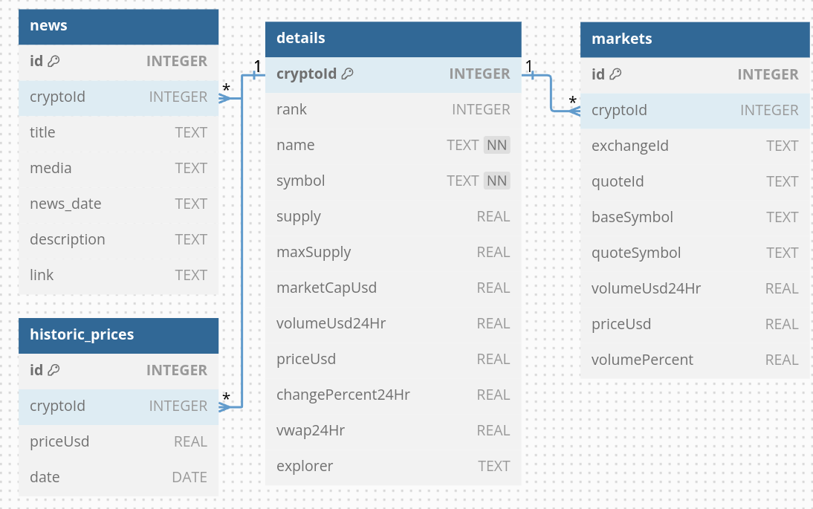

# Cryptocurrency Data Processing

This project processes cryptocurrency data, providing functionality to manage and query data from multiple sources, including a SQLite database and CSV files. It includes modules for retrieving cryptocurrency info, news, and storing historical prices.

## Table Schema

The diagram below represents the schema of the tables used in this project:


## Project Structure

```plaintext
├── datasource                 # Data source folder
│   ├── crypto_schema_setup.sql # SQL script for creating the database schema
├── libs                       # Libraries for different functionalities
│   ├── request               # Request module for web scraping and API calls
│   │   ├── crypto_info.py    # Python script to fetch cryptocurrency info
│   │   ├── news.py           # Python script to fetch cryptocurrency news
│   └── sql                   # SQL module for database interactions
│       └── sqlite_manager.py # Python script to manage SQLite operations
├── LICENSE                    # Project's license file
├── main.py                    # Main script to run the project
└── README.md                  # This README file
```

## Setup and Installation

To get started with the project, you need to set up the environment and dependencies.

### Prerequisites

- Python 3.10 or later
- SQLite3
- ChromeDriver (for web scraping)

### Installation Steps

1. Clone the repository to your local machine:
   ```bash
   git clone https://github.com/yourusername/CaseCadastra.git
   cd CaseCadastra
   ```

2. Install the required dependencies:
   ```bash
   pip install -r requirements.txt
   ```

3. To use ChromeDriver for web scraping, download it from the official [ChromeDriver site](https://sites.google.com/chromium.org/driver/), ensuring the version matches your Google Chrome browser. Extract the file and place the `chromedriver` executable in the `chromedriver/` directory of this project. Alternatively, you can add its path to your system's PATH environment variable for global access. Verify the installation by running `chromedriver --version` in your terminal.

### Running the Project

You can run the project by executing the `main.py` script:

```bash
python main.py
```

This will process the data, interact with the SQLite database, and fetch cryptocurrency news and information.

## File Descriptions

### `datasource/crypto_schema_setup.sql`

SQL script used to set up the initial database schema for storing cryptocurrency data.

### `libs/request/`

This folder contains Python scripts for fetching cryptocurrency data and news from APIs or web scraping:
- `crypto_info.py`: Retrieves information about cryptocurrencies.
- `news.py`: Retrieves cryptocurrency news.

### `libs/sql/`

This folder contains Python scripts to manage interactions with the SQLite database:
- `sqlite_manager.py`: Manages SQLite operations, such as inserting and retrieving data.

### `main.py`

The entry point of the project. Runs the main logic, including fetching data and storing it in the database.

## Contributing

If you want to contribute to this project, feel free to fork the repository, make changes, and submit a pull request. Please ensure your code follows the existing style and includes appropriate tests.

## License

This project is licensed under the MIT License - see the [LICENSE](LICENSE) file for details.

### Dashboard Access

Access the project dashboard to explore and analyze cryptocurrency data: 
[Project Dashboard](https://lookerstudio.google.com/reporting/da3719f4-ef0c-41bf-a663-cb1286ef83d7)
